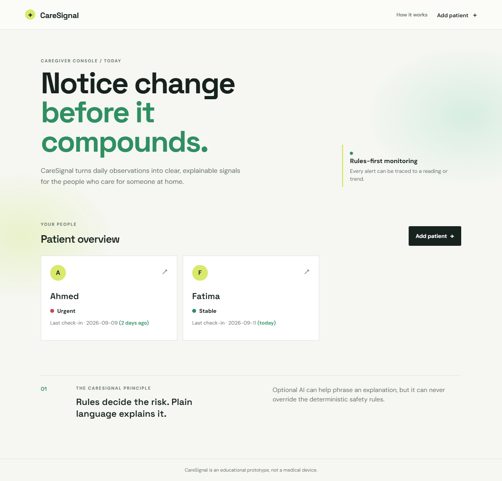
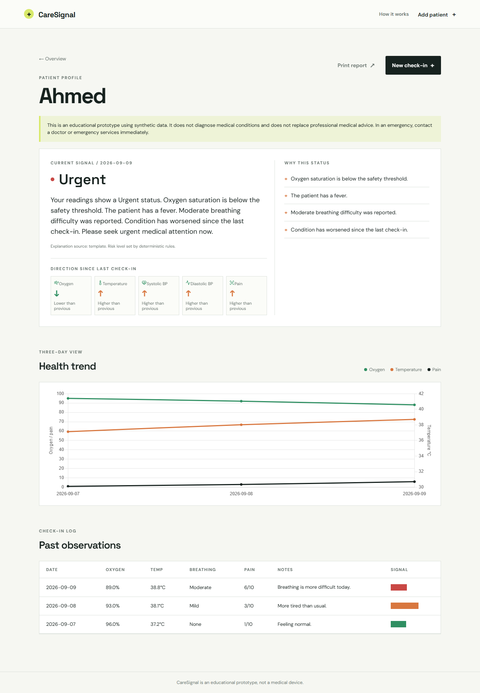
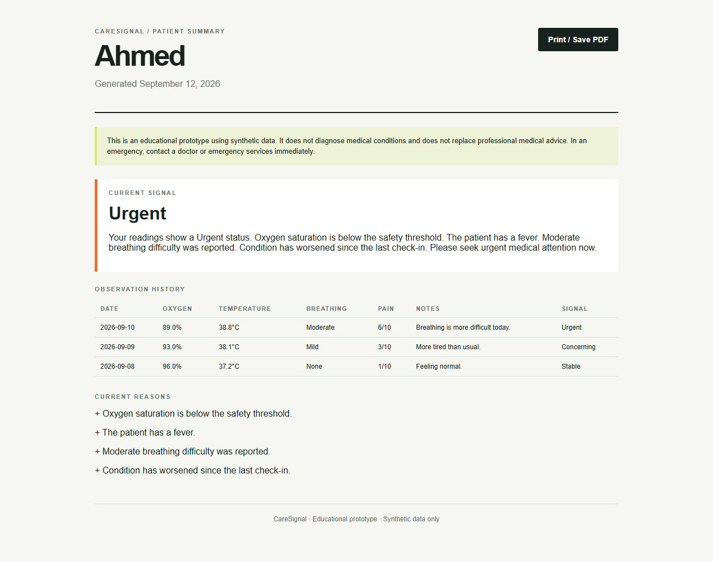
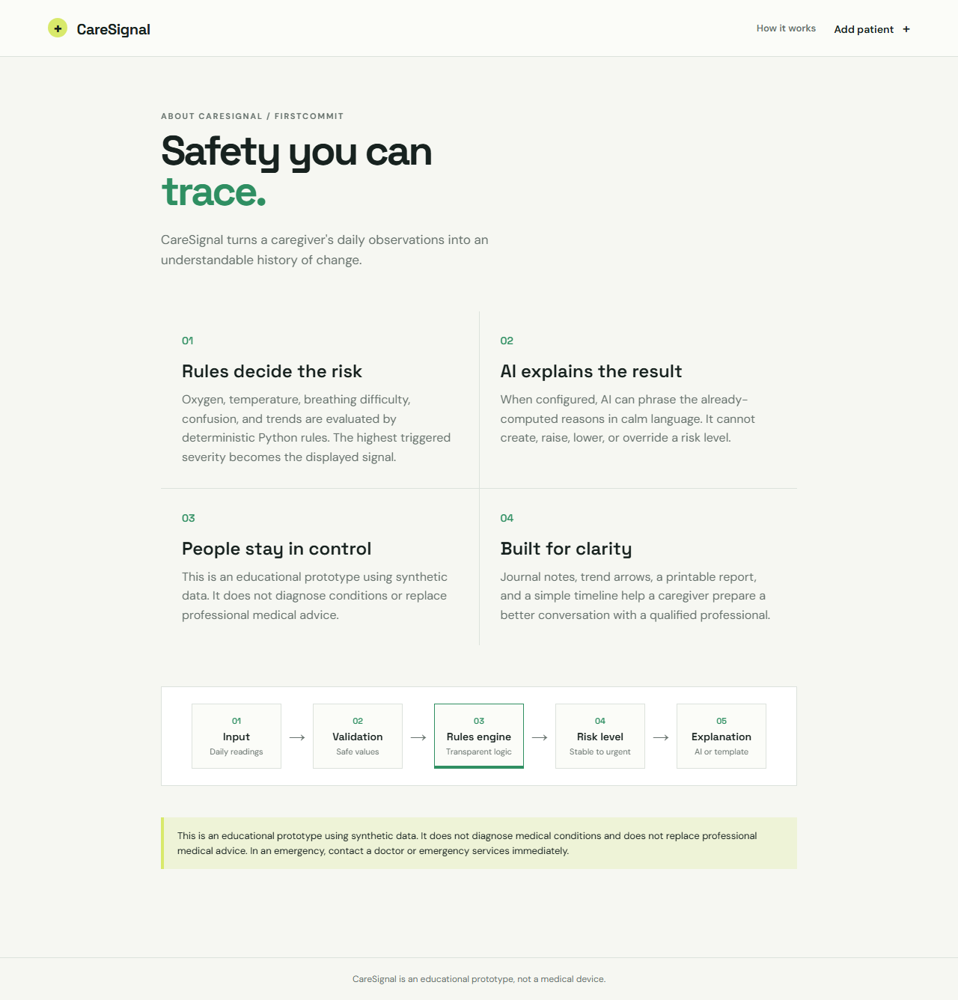

# CareSignal

CareSignal is a Flask-based, explainable, rules-based health trend monitoring prototype for family caregivers. This release is prepared for the FirstCommit general web app category using synthetic data, not a medical device or diagnostic system.

## What it does

- Stores patients and daily observations in SQLite.
- Checks oxygen, temperature, breathing difficulty, confusion, pain, and medication adherence.
- Uses deterministic Python rules to assign Stable, Monitor, Concerning, or Urgent status.
- Escalates when a patient's risk is higher than the previous observation.
- Explains the result with a local template by default.
- Optionally uses an OpenAI-compatible API for wording only when `AI_API_KEY` is available. The API cannot change risk or emergency status.
- Visualizes oxygen, temperature, and pain trends with Chart.js.

## Project overview

CareSignal helps family caregivers notice gradual changes in a patient's health across multiple daily check-ins. It is designed for a hackathon demonstration using synthetic data, not for diagnosis, treatment decisions, or emergency response.

The main workflow is simple: create a patient, record an observation, review the current signal, and inspect the trend chart. Each signal includes the readings and rules that caused it, so the result is explainable rather than a mysterious model output.

## FirstCommit feature set

- Multi-patient dashboard with current signal and human-readable last check-in age.
- Daily check-ins with oxygen, temperature, blood pressure, breathing, pain, confusion, medication adherence, and caregiver journal notes.
- Deterministic risk rules with visible reasons and raw-direction trend indicators.
- Chart.js timeline for oxygen, temperature, and pain.
- Printable patient summary that can be saved as a PDF from the browser.
- Friendly validation for missing, malformed, duplicate-date, and out-of-range input.
- Empty-state onboarding and an in-app safety architecture page.
- Optional AI wording with a guaranteed local fallback; AI never decides risk.
- Calm dashboard-only animated gradient visual layer with no WebGL dependency.
- Page transitions, subtle risk-arrival animation, favicon, metadata, Lucide vital icons, and an architecture diagram.

The visual layer is presentational only. It does not participate in validation, risk calculation, chart data, or AI explanation. The dashboard uses a lightweight CSS animated gradient instead of Three.js so unsupported WebGL, large bundles, or CDN failures cannot affect the core app. Detail, check-in, and report pages remain visually restrained for readability.

## Setup on Windows PowerShell

```powershell
git clone https://github.com/imadahmad9507-ops/CareSignal.git
cd CareSignal
python -m venv .venv
.\.venv\Scripts\Activate.ps1
pip install -r requirements.txt
python seed.py
python app.py
```

Open <http://127.0.0.1:5000> in a browser.

## Live deployment

CareSignal is deployed on Vercel at [caresignal-firstcommit.vercel.app](https://caresignal-firstcommit.vercel.app).

The Vercel adapter is in `api/index.py` and `vercel.json`. On a fresh deployment, the app seeds Ahmed and Fatima automatically. Because this prototype uses SQLite, Vercel's serverless filesystem is ephemeral; the public deployment is intended for demonstration and resets may occur between cold starts. Local development remains the reliable place for persistent demo edits.

The app works without an AI key. To enable optional explanation wording through an OpenAI-compatible endpoint, set environment variables before starting Flask:

```powershell
$env:AI_API_KEY = "your-key"
$env:AI_API_ENDPOINT = "https://api.openai.com/v1/chat/completions"
$env:AI_MODEL = "gpt-4o-mini"
python app.py
```

Never commit API keys. The default template fallback is the intended no-key demonstration mode.

## Screenshots

The following screenshots were captured automatically with Playwright at 1280x800:



_Dashboard showing contrasting Ahmed and Fatima patient profiles._



_Ahmed's Stable → Concerning → Urgent history, notes, chart, and explanations._



_Print-friendly patient summary suitable for browser PDF export._



_Visual explanation of Input → Validation → Rules Engine → Risk Level → AI Explanation._

To regenerate them locally:

```powershell
python -m playwright install chromium
python screenshot_capture.py
```

## How the safety architecture works

1. The check-in is validated and stored locally in SQLite.
2. The pure Python rule engine in `risk_rules.py` checks each reading and compares it with the previous observation.
3. The highest triggered severity becomes the final signal: Stable, Monitor, Concerning, or Urgent.
4. Missing readings are treated as unknown and flagged for monitoring; they are never silently treated as normal.
5. `explanations.py` receives the already-computed signal and reasons. Optional AI can only phrase those facts in plain language.
6. If the AI key is missing, the network fails, or the response is invalid, the local template explanation is returned.

AI cannot determine or override risk or emergency status. The interface repeatedly identifies the prototype as educational and instructs users to contact qualified professionals in an emergency.

## Demo scenario

`python seed.py` creates two deterministic demo patients. Ahmed has exactly three observations:

- Day 1: oxygen 96, temperature 37.2, no breathing difficulty -> Stable
- Day 2: oxygen 93, temperature 38.1, mild breathing difficulty -> Concerning
- Day 3: oxygen 89, temperature 38.8, moderate breathing difficulty -> Urgent

Fatima has three stable, low-risk observations so the dashboard shows a useful contrast. Running `python seed.py` again resets both demo patients' observations without creating duplicates. For a completely clean demo database after manual experimentation, run `python -m flask --app app reset-db` and then `python seed.py`.

## Edge-case checks

Run the reproducible rules test from the project directory:

```powershell
python test_scenarios.py
```

It covers stable data, missing readings, a sudden emergency, a borderline reading, and a patient whose condition improves.

The FirstCommit one-page submission copy is in `FIRSTCOMMIT_PROJECT_DESCRIPTION.md` and can be exported or formatted as a PDF for the hackathon submission.

## Challenges overcome

- **API key access:** The project was designed so no secret is required. A local explanation template keeps the app functional when an AI key is unavailable, invalid, rate-limited, or offline.
- **Safety versus pure AI:** We separated risk calculation from explanation. Deterministic rules decide severity; optional AI only rephrases known reasons.
- **Framework confusion:** The project briefly contained both Flask and Streamlit versions. Flask was retained because it had the complete multi-page workflow, Chart.js detail view, printable report path, and browser-tested forms. The final repository contains only Flask.
- **Data edge cases:** Missing values, duplicate check-in dates, malformed numbers, and out-of-range readings now produce understandable feedback rather than server errors.

## What I learned

- A smaller transparent system can be more trustworthy than a larger model-driven feature when the domain is safety-sensitive.
- Separating data, rules, explanations, and presentation makes it easier to test behavior and change the interface safely.
- Browser-level testing catches issues that unit-style checks miss, including form redirects, rendered disclaimers, chart payloads, and print views.
- A polished submission needs both a reliable happy path and explicit handling for the awkward inputs users actually enter.

## Project structure

```text
CareSignal/
├── app.py
├── database.py
├── explanations.py
├── risk_rules.py
├── seed.py
├── test_scenarios.py
├── FIRSTCOMMIT_PROJECT_DESCRIPTION.md
├── FIRSTCOMMIT_DEMO_VIDEO_SCRIPT.md
├── TESTING.md
├── screenshot_capture.py
├── screenshots/
│   ├── dashboard.png
│   ├── ahmed-detail.png
│   ├── patient-report.png
│   └── about-safety.png
├── requirements.txt
├── README.md
├── instance/              # created automatically; SQLite database lives here
├── templates/
│   ├── base.html
│   ├── dashboard.html
│   ├── new_patient.html
│   ├── check_in.html
│   └── patient_detail.html
└── static/
    ├── css/style.css
    └── js/chart.js
```

## Credits and external resources

- **Framework & Runtime:** [Flask](https://flask.palletsprojects.com/) (Python web framework)
- **Data Visualization:** [Chart.js](https://www.chartjs.org/) (Client-side interactive charting)
- **Iconography:** [Lucide Icons](https://lucide.dev/) (SVG vital-sign icons)
- **Typography:** [Google Fonts](https://fonts.google.com/) (Space Grotesk and DM Sans)
- **Automated Verification:** [Playwright](https://playwright.dev/) (Automated headless browser screenshot capture)

## AI usage disclosure

In accordance with FirstCommit rules, AI tools (large language models) were used during development as learning and brainstorm aids to explore edge-case scenarios, generate code drafts, debug syntax, and refine documentation. 

All clinical risk logic in CareSignal is completely deterministic, inspectable, and human-written in Python rules (`risk_rules.py`). The optional runtime AI integration (`explanations.py`) is strictly constrained to phrasing explanations in plain English and has zero authority to determine or alter clinical risk levels.

